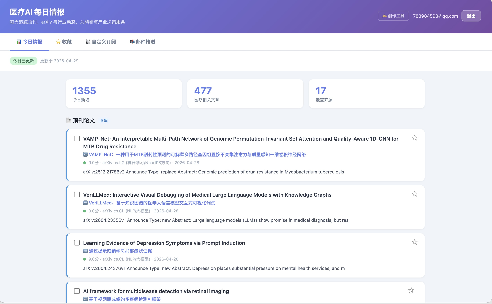
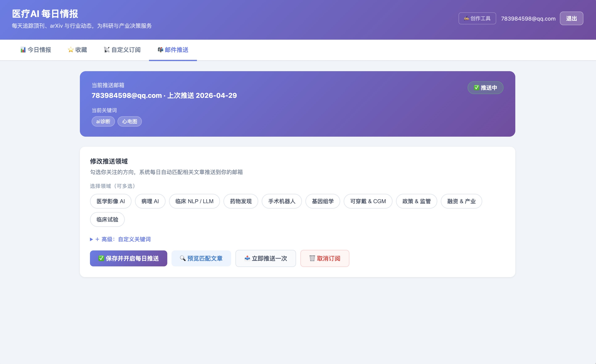
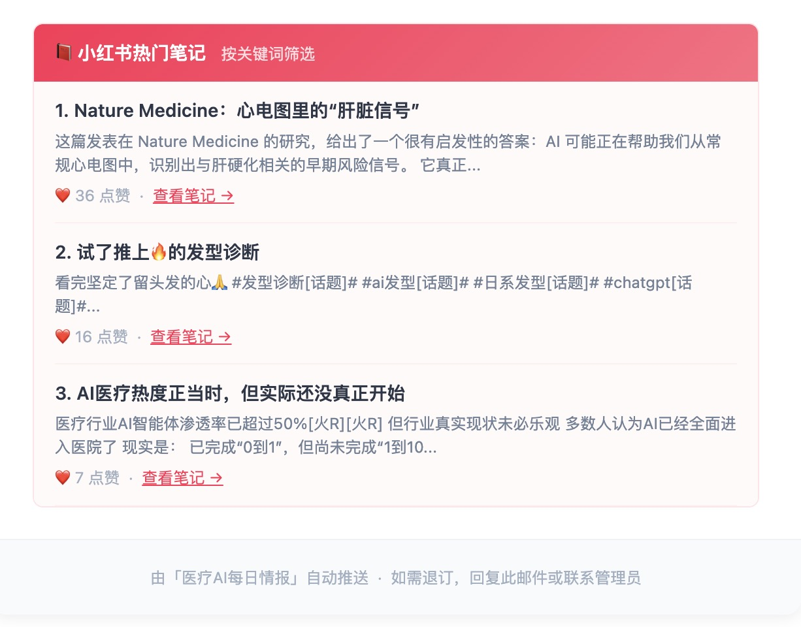

# 医疗AI每日情报系统

> **Medical AI Daily Intelligence System** — 自动抓取医疗AI领域顶刊论文与行业资讯，经 DeepSeek 评分筛选后，通过三轮 AI 生成流程产出可直接发布的微信公众号文章。

**在线体验**：[medai.sugarclaw.top](https://medai.sugarclaw.top/)


<table>
  <tr>
    <td align="center"><b>情报浏览</b></td>
    <td align="center"><b>关键词订阅</b></td>
  </tr>
  <tr>
    <td></td>
    <td></td>
  </tr>
</table>

<table>
  <tr>
    <td colspan="2" align="center"><b>邮件推送效果</b></td>
  </tr>
  <tr>
    <td></td>
    <td></td>
  </tr>
</table>

---

## 功能亮点

- **16+ RSS 源自动抓取** — Nature Medicine、Lancet Digital Health、NEJM AI、arXiv 等顶刊 + 行业媒体
- **AI 评分筛选** — DeepSeek 对文章打质量分（0-10），只保留医疗 × AI 双属性文章
- **三轮生成流程** — DeepSeek 并行 3 篇初稿 → GPT-4.1 审核打分 → DeepSeek 润色终稿
- **质量兜底** — 最优初稿低于 7.0 分自动补生成 2 篇，从 5 篇中选最优
- **关键词订阅推送** — 填写邮箱 + 关键词，每日自动推送匹配文章 + 小红书热门笔记
- **小红书热门笔记抓取** — 根据订阅关键词自动搜索小红书，按点赞数排序筛选热门笔记，随每日邮件一起推送
- **用户系统** — 邮箱注册/登录，游客可浏览全部情报，登录后解锁收藏、生成、草稿等操作
- **Web 界面** — 每日情报浏览、文章选择、一键生成、草稿管理、订阅管理

---

## 环境要求

- Python 3.9+
- Node.js 18+（小红书签名加密需要）
- [DeepSeek API Key](https://platform.deepseek.com/)（评分 + 生成）
- [GitHub Token](https://github.com/settings/tokens)（需勾选 Models 权限，GPT-4.1 审核用）

## 快速开始

### 1. 安装

```bash
git clone https://github.com/zhengwenxin79-ctrl/content-pipeline.git
cd content-pipeline

python3 -m venv .venv
source .venv/bin/activate
pip install -r requirements.txt
npm install crypto-js
```

### 2. 配置环境变量

```bash
cp .env.example .env
```

编辑 `.env`：

```env
DEEPSEEK_API_KEY=your_deepseek_api_key
GITHUB_TOKEN=your_github_token
MAIL_SENDER=your_qq_email@qq.com        # QQ 邮箱 SMTP 发件
MAIL_PASSWD=your_qq_smtp_auth_code       # QQ 邮箱授权码
XHS_COOKIE=your_xiaohongshu_cookie       # 浏览器 F12 复制，约 30 天过期
```

> ⚠️ 请勿将 `.env` 文件提交到 Git。项目中已包含 `.gitignore` 规则。

### 3. 启动

```bash
python3 server.py
# 访问 http://localhost:8888
```

数据库在首次启动时自动创建。

---

## CLI 命令

```bash
python3 main.py init             # 初始化数据库
python3 main.py fetch            # 抓取所有 RSS 源
python3 main.py score            # AI 评分（--limit N）
python3 main.py titles           # 生成标题建议（--topic 主题）
python3 main.py daily            # 一键执行：抓取 + 评分 + 标题 + 推送
python3 main.py digest           # 生成每日情报摘要（--topic --days N）
python3 main.py enrich           # 为短文章补充完整摘要（CrossRef/arXiv/S2）
python3 main.py stats            # 查看语料库统计
python3 main.py import-post      # 导入自己的历史文章
python3 main.py import-wechat    # 导入微信公众号文章（--url / --url-file / --md-dir）
```

---

## 部署到 Render（免费）

### 1. Fork 本仓库

### 2. 注册 [Render](https://render.com)，用 GitHub 登录

### 3. 新建 Web Service

| 字段 | 值 |
|------|-----|
| Language | Python |
| Branch | main |
| Start Command | `python server.py` |
| Instance Type | Free |

### 4. 配置环境变量

在 **Environment** 页面添加：

| 变量名 | 说明 |
|--------|------|
| `DEEPSEEK_API_KEY` | DeepSeek API Key |
| `GITHUB_TOKEN` | GitHub Token（GPT-4.1 审核用） |
| `MAIL_SENDER` | 发件 QQ 邮箱 |
| `MAIL_PASSWD` | QQ 邮箱 SMTP 授权码 |
| `XHS_COOKIE` | 小红书 Cookie（登录后 F12 复制） |
| `AUTH_SALT` | 密码（可选），不设则使用默认值 |

### 5. 部署

点击 **Deploy Web Service**，等待构建完成（约 3 分钟）即可访问。

> ⚠️ Render 免费版无持久化存储，每次重新部署数据库会清空。如需持久化，升级到 Starter（$7/月）并挂载 Disk。

---

## 项目结构

```
content-pipeline/
├── server.py              # Web 服务器 + API + 前端页面（含用户认证）
├── main.py                # CLI 入口
├── analyze.py             # DeepSeek 评分、标题推荐、摘要生成
├── db.py                  # SQLite 操作（含用户表、自动迁移）
├── mailer.py              # 邮件推送 + 小红书抓取 + 关键词匹配
├── generate.py            # 三轮 AI 生成（初稿→审核→润色）
├── config.yaml            # RSS 源配置
├── requirements.txt
├── Procfile               # Render 启动配置
├── prompts/               # 三轮生成的 Prompt 文档
│   ├── 01_draft_generation.md
│   ├── 02_review_audit.md
│   └── 03_final_polish.md
├── scrapers/
│   ├── rss.py             # RSS 抓取
│   ├── wechat.py          # 微信公众号文章导入（wewe-rss）
│   ├── xhs_fetcher.py     # 小红书关键词搜索
│   ├── xhs_pc_apis.py     # 小红书 API 封装
│   ├── xhs_util.py        # 小红书签名工具
│   ├── xhs_cookie_util.py # Cookie 解析
│   ├── xhs_static/        # JS 加密文件
│   ├── enrich.py          # 内容增强（CrossRef/arXiv/S2）
│   └── manual.py          # 手动录入
└── data/
    └── my_posts_template.md
```

---

## 技术栈

| 层 | 技术 |
|----|------|
| 后端 | Python 3.9，标准库 `http.server`（无框架） |
| 数据库 | SQLite（自动建表 + 迁移） |
| AI | DeepSeek API（评分 + 生成）、GitHub Models GPT-4.1（审核） |
| 抓取 | feedparser（RSS）、requests + BeautifulSoup（网页）、Node.js（小红书签名） |
| 认证 | SHA-256 密码哈希，内存 session token（30 天 cookie） |
| 前端 | 纯 HTML/CSS/JS，内联于 server.py |
| 部署 | Render Web Service（免费层） |

---

## 致谢

- [DeepSeek](https://platform.deepseek.com/) — AI 评分与内容生成
- [GitHub Models](https://github.com/marketplace/models) — GPT-4.1 审核服务
- [wewe-rss](https://github.com/cooderl/wewe-rss) — 微信公众号 RSS 转换
- [feedparser](https://feedparser.readthedocs.io/) — RSS 解析
- 邮箱推送参考项目：[Daily-Digest-Assistant](https://github.com/yzbcs/Daily-Digest-Assistant)

---

## 贡献

欢迎 Issue 和 PR！

1. Fork 本仓库
2. 创建特性分支：`git checkout -b feature/your-feature`
3. 提交改动：`git commit -m "Add your feature"`
4. 推送分支：`git push origin feature/your-feature`
5. 发起 Pull Request

## License

MIT License

<!-- TODO: 添加 Star History 图表（取消注释并替换用户名） -->
<!--
## Star History
[](https://star-history.com/#zhengwenxin79-ctrl/content-pipeline&Date)
-->
